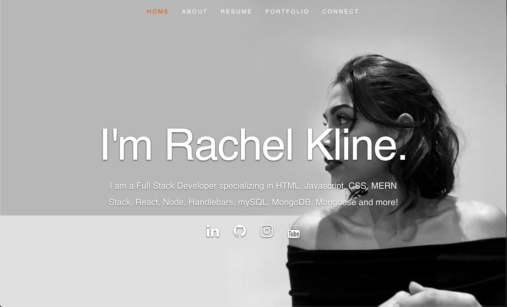

# React Portfolio


## Deployed Link: https://rachelkline-portfolio.herokuapp.com/



---

## Description

  *The what, why, and how:*

`PROJECT DESCRIPTION:` We were tasked with creating a new portfolio application using React. We were asked to include our name, links to our GitHub & LinkedIn profiles (as well as our email and phone number), and a list of projects that included the project title and links to the Deployed site & repositories.

We were tasked with including at least 3 components: a Header, a Project component (in my case, I called my component 'portfolio'), and a Footer. We were also challenged to try and use react component libraries to use animations.


  ---


## Table of Contents

  - [Deployed Site](#deployed-site)
  - [Description](#description)
  - [Technologies](#technologies)
  - [Directory Structure](#directory-structure)
  - [Questions](#questions)
 

---


## Technologies
*Technologies used in this project:*
 - Javascript
 - Express
 - Node.js
 - MongoDB
 - Mongoose

 ---
 

## Directory Structure
```
├── node_modules
│ 
├── public
│   >css
│   └── layout.css 
│   >rmImgs
│   
│   
├── index.html
│   
├── init.js    
│
├── >src
│   └── App.js 
│   └── index.js 
│   └── resumeData.js 
│   └── >components 
│           └── About.js
│           └── Footer.js
│           └── Header.js
│           └── Portfolio.js
│           └── Resume.js
│
├── .gitignore
│ 
├── package.json
│ 
│ 
└── README.md
```

---


## Questions?

  *For any questions about this application, please contact me via the information below:*

  * **GitHub:** https://github.com/rachelkline
  
  * **Email:** rachel_kline@icloud.com

---
  <br>

  [Icons provided by https://fontawesome.com/]